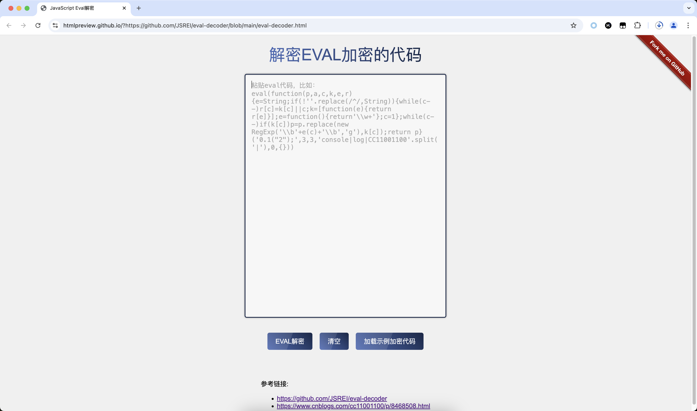
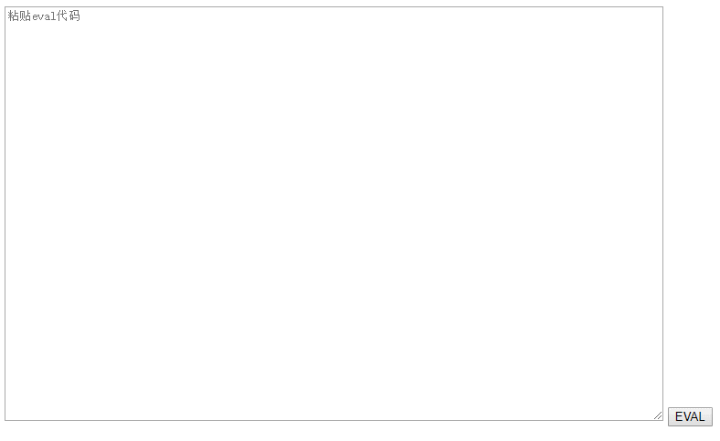

# Eval加密解密原理与工具

GitHub Repository：https://github.com/JSREI/eval-decoder

简体中文| [English](README_en.md)

# 一、在线解密

点击链接进入在线解密页面：

[https://htmlpreview.github.io/?https://github.com/JSREI/eval-decoder/blob/main/eval-decoder.html](https://htmlpreview.github.io/?https://github.com/JSREI/eval-decoder/blob/main/eval-decoder.html)



# 二、原理探究：jspacker压缩及解压缩研究(js eval)

## 2.1 起因

在研究爬虫的时候发现很多网站都出现了同一种方式的js混淆，并且名字都是pde.js，怀疑是使用了同一款混淆工具，所以研究一下。

这款工具叫JS Packer，并不是专门的混淆工具，而是一款js压缩工具，其官网地址为： http://dean.edwards.name/packer/

支持两种压缩方式，一种是Shrink variables比较常规的压缩方式，就是去掉一些空白符注释之类的，另一种是Base62 encode，是一种比较适合用来压缩内容单词重复率高的压缩方式。

## 2.2 压缩示例

所有讨论基于Base62 encode压缩方式，输入：

``` js
alter("hello, world");
```

输出：

```js
eval(function(p,a,c,k,e,r){e=String;if(!''.replace(/^/,String)){while(c--)r[c]=k[c]||c;k=[function(e){return r[e]}];e=function(){return'\\w+'};c=1};while(c--)if(k[c])p=p.replace(new RegExp('\\b'+e(c)+'\\b','g'),k[c]);return p}('0("1, 2");',3,3,'alter|hello|world'.split('|'),0,{}))
```

格式化后：

```js
eval(function (p, a, c, k, e, r) {
    e = String;
    if (!''.replace(/^/, String)) {
        while (c--) r[c] = k[c] || c;
        k = [function (e) {
            return r[e]
        }];
        e = function () {
            return '\\w+'
        };
        c = 1
    }
    ;
    while (c--) if (k[c]) p = p.replace(new RegExp('\\b' + e(c) + '\\b', 'g'), k[c]);
    return p
}('0("1, 2");', 3, 3, 'alter|hello|world'.split('|'), 0, {}))
```

面的代码看着很唬人，其实原理很简单，我们耐心分析下。

## 2.3 压缩原理：

简单来说就是将相同的单词进行压缩，具体为将所有单词抽取出来作为一个词典，然后将源代码中表示单词的地方改为引用词典的下标，这样的话当重复的单词很多的时候压缩效果就比较好，但是当重复的单词比较少的时候这种方法有点得不偿失。

带入具体数据来具体分析，比如下面的代码：

```js
console.log("aaaaa");
console.log("aaaaa");
console.log("bbbb");
```

压缩之后格式化：

```js
eval(function(p, a, c, k, e, r) {
    e = String;
    if (!''.replace(/^/, String)) {
        while (c--) r[c] = k[c] || c;
        k = [function(e) {
            return r[e]
        }];
        e = function() {
            return '\\w+'
        };
        c = 1
    };
    while (c--) if (k[c]) p = p.replace(new RegExp('\\b' + e(c) + '\\b', 'g'), k[c]);
    return p
} ('0.1("2");0.1("2");0.1("3");', 4, 4, 'console|log|aaaaa|bbbb'.split('|'), 0, {}))
```

可以看到规律已经很明显了，第一个 参数 '0.1("2");0.1("2");0.1("3");'中的数字对应着 'console|log|aaaaa|bbbb'.split('|') 中的下标，解压的时候只需要再将数字下标还原为单词即可。

下面是对解压缩算法的一个简单解读：

```js
// p 将原始内容中所有单词替换为字典下标后的压缩内容
// a 词典大小，暂时用不到
// c 词典大小，在解压时用来关联压缩内容和词典
// k 词典
// e 在解压时，当replace第二个参数支持function时，为\\w+，否则为与下标对应的字符串
// r 当加速解压时用来保存词典
eval(function(p, a, c, k, e, r) {
    e = String;
 
    // 检测当前的浏览器是否支持replace(regex, function)，如果支持的话就能够加快解压速度
    // 如果不支持的话可以把这一块直接忽略掉
    if (!''.replace(/^/, String)) {
 
        // 把被压缩的单词拷贝一份，因为k还有别的用处
        while (c--) r[c] = k[c] || c;
 
        // k[0]后面用来对每个匹配到的下标寻找替换字符串
        k = [function(e) {
            return r[e]
        }];
 
        // 用来分割原始内容
        e = function() {
            return '\\w+'
        };
 
        // 加速解压的时候，相当于把while变成了if
        c = 1
    };
 
    // 使用词典将压缩后的下标代码扩展，如果没有上面的加速的话，c等于词典单词数，要一个一个替换了
    // 如果支持replace(string, function)的话，会将匹配到的每一个数字都传递给k[c]来得到其应该被替换为的字符串
    while (c--) if (k[c]) p = p.replace(new RegExp('\\b' + e(c) + '\\b', 'g'), k[c]);
 
    // 完成解压
    return p
} ('0.1("2");0.1("2");0.1("3");', 4, 4, 'console|log|aaaaa|bbbb'.split('|'), 0, {}))
```

## 2.4 解压缩小工具

我把这种 eval(blablabla…) 形式的统称为eval压缩，并针对此写了个一个简单的解压小工具。

思路：

1. 既然这种肯定是要在网页上执行的，那么只需要模拟执行就可以了。

2. 可能不只有一层eval，所以应该能够方便的多次连续eval。

html代码如下：

```html
<html lang="zh">
<head>
    <meta charset="UTF-8">
    <title>JavaScript Eval解密</title>
</head>
<body>

<label for="eval_code">Eval加密的代码：</label><textarea id="eval_code" cols="100" rows="30"
                                                        placeholder="粘贴eval代码"></textarea>
<button onclick="executeEval()">EVAL解密</button>

<script type="text/javascript">

    // Hook覆盖

    // 这个placeholder比较大，通过JS来设置
    (function () {
        const placeholder = `粘贴eval代码，比如：
eval(function(p,a,c,k,e,r){e=String;if(!''.replace(/^/,String)){while(c--)r[c]=k[c]||c;k=[function(e){return r[e]}];e=function(){return'\\\\w+'};c=1};while(c--)if(k[c])p=p.replace(new RegExp('\\\\b'+e(c)+'\\\\b','g'),k[c]);return p}('0.1("2");',3,3,'console|log|CC11001100'.split('|'),0,{}))`;
        document.getElementById("eval_code").setAttribute("placeholder", placeholder);
    })();

    function executeEval() {
        let evalCodeElt = document.getElementById("eval_code");
        let evalCode = evalCodeElt.value;
        // 如果不把开头的eval去掉的话直接执行会被执行两遍
        evalCode = evalCode.replace(/^eval/, "");
        if (!evalCode) {
            alert("请在文本框内粘贴被Eval加密的JavaScript代码！");
            return;
        }
        try {
            evalCodeElt.value = eval(evalCode);
        } catch (e) {
            alert("执行报错了：" + e);
        }
    }
</script>
</body>
</html>
```

效果如下：



# 三、参考资料

- [https://www.cnblogs.com/cc11001100/p/8468508.html](https://www.cnblogs.com/cc11001100/p/8468508.html)

# 四、逆向技术交流群

扫码加入逆向技术交流群：


如群二维码过期，可以加我个人微信，发送【逆向群】拉你进群：


[点此](https://t.me/jsreijsrei)或扫码加入TG交流群：


